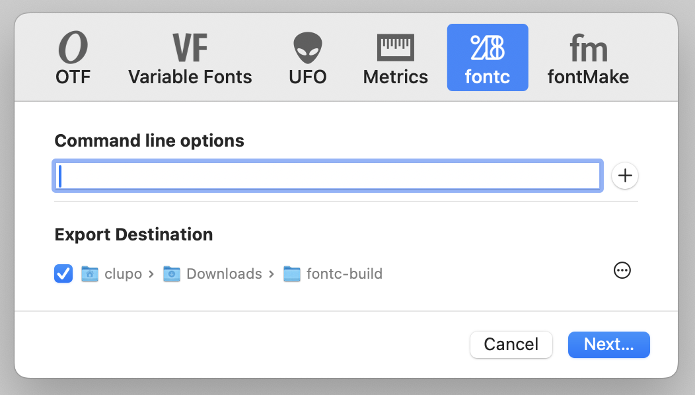

### fontc export plugin

An export plugin for Glyphs that uses [fontc](https://github.com/googlefonts/fontc) to export fonts. When installed, it shows up in the regular Export dialog (Cmd+E).

It downloads a standalone fontc executable inside the plugin, which is removed when the plugin is deleted. 

The "Command line options" accept whatever fontc accepts. 
